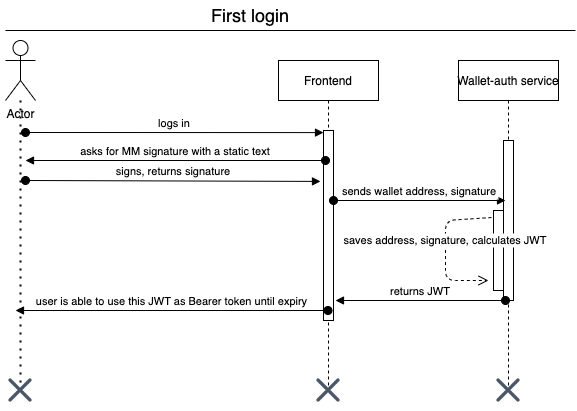
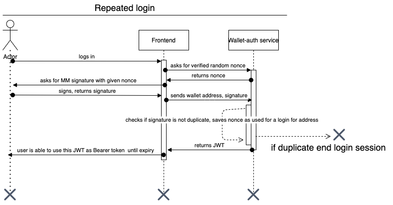

# Wallet Authorization Service Login Flows

Using verified random nonces makes pseudonimous logins traceable.
Using nonces as input terms in JWT generation makes each address' session traceable and unique.

## Unqiueness of a nonce

In our implementation, a nonce cannot be used for authentication twice for the same address. This means that even with a long expiry of the JWT issued for an address, it is able to authenticate and establish a session with that JWT once.

## Analogy

Address X makes a reentrancy attack and for some reason it is able to run away with some funds. To be able to call our endpoints, it needed to establish a session, therefore in generated a nonce that is registered in our Authorization Server. From that point, we are able to trace all activities he/she/they did within that particular session and never replicate it.

## First login flow

At the first registration, we present the user with a premade text to be signed, simply to register their address into our Authorization database. After the first registration, they will be able to sign in via nonces only.

## Repeated login flow

After the user is registered, they will be authenticated based on unqiue nonces like below.

